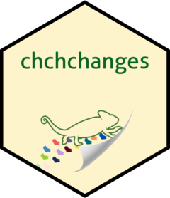

<!-- README.md is generated from README.Rmd. Please edit that file -->

```{r, include = FALSE}
knitr::opts_chunk$set(
  collapse = TRUE,
  comment = "#>",
  fig.path = "man/figures/README-",
  out.width = "100%"
)
```

# chchchanges 

<!-- badges: start -->
[](https://github.com/beanumber/chchchanges/actions/workflows/R-CMD-check.yaml)
<!-- badges: end -->

The purpose of this package is to breakdown the commits history between multiple users working on a git repository on RStudio. 
This will allow a friendlier preview of who, where and when commits are made.

## Installation

You can install the development version of chchchanges like so:

```{r, eval=FALSE}
# install.packages("remotes")
remotes::install_github("sds270-f24/chchchanges")
```

## Examples

There are different functions that can be called depending on the users needs

### Example 1 

Count the amount of commits from each user

```{r}
library(chchchanges)
authors_commit(file_name = "README.md")
```

### Example 2

List the hunks within the repository

```{r}
hunks(file_name = "README.md")
```

### Example 3

Retrieves the authors GitHub username along with commit id in order from most last to recent

```{r, error=TRUE}
get_all_commit_shas()
```

### Example 4

Extracts the names from each hunk

```{r, error=TRUE}
extract_name("README.md")
```

### Example 4

Summary of the information above
```{r, error=TRUE}
create_summary_table("README.md")
```

## Developers

- [Nicole Sanchez Flores](https://github.com/NicoleSanchezFlores)
- [Debora Camacho](https://github.com/dmcam02)
- [Ananda Wilkinson](https://github.com/anandaw2)
