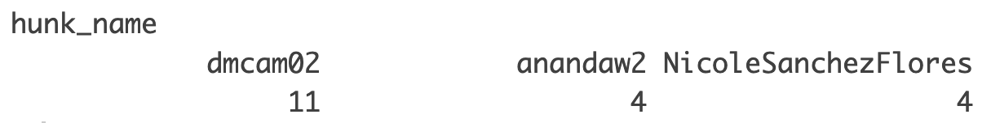
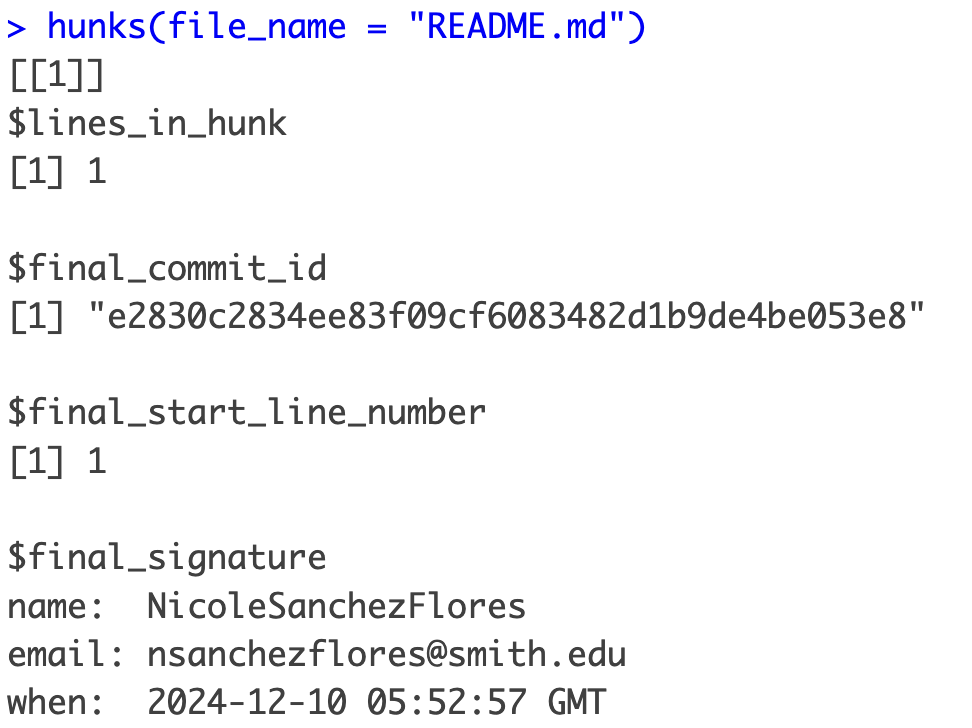
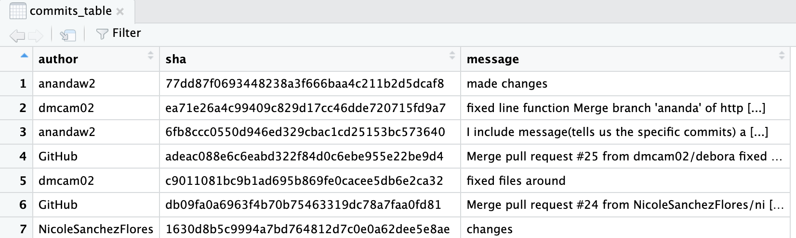
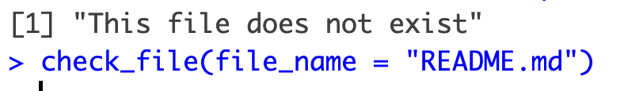
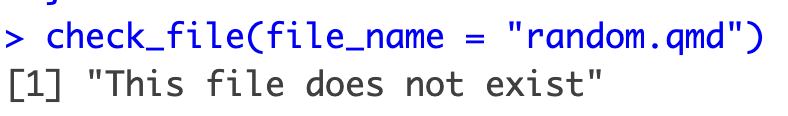
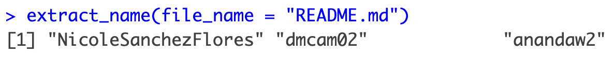

## Overview

The purpose of this package is to breakdown the commits history between multiple users working on a git repository on R-Studio. This will allow a friendlier preview of who, where and when commits are made.

## Installation 

You can install the development version of wnbaplayeRs from [GitHub](https://github.com/) with:

``` r
# install.packages("devtools")
devtools::install_github("sds270-f24/chchchanges")
```

## Examples

There are different functions that can be called depending on the users needs

### Example 1 

Count the amount of commits from each user

```{r}
authors_commit(file_name = "README.md")
```


### Example 2

List the hunks within the repository

```{r}
hunks(file_name = "README.md")
```


### Example 3

Retrieves the authors GitHub username along with commit id in order from most last to recent

```{r}
get_all_commit_shas <- function(repo_path = getwd())
```


### Example 4

Check to see if the file exist and then empty 

```{r}
check_file(file_name = "functions.R")
```




Extracts the names from each hunk

```{r}
extract_name(hunk = "functions.R")
```


### Example 4

Summary of the information above
```{r}
create_summary_table(file_name, repo_path = getwd())
```

## Developers

- [Nicole Sanchez Flores](https://github.com/NicoleSanchezFlores)
- [Debora Camacho](https://github.com/dmcam02)
- [Ananda Wilkinson](https://github.com/anandaw2)
