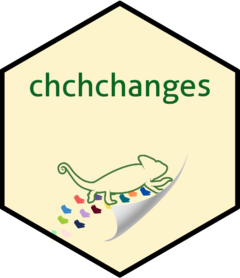

<!-- README.md is generated from README.Rmd. Please edit that file -->

# chchchanges 

<!-- badges: start -->

[](https://github.com/beanumber/chchchanges/actions/workflows/R-CMD-check.yaml)
<!-- badges: end -->

The purpose of this package is to breakdown the commits history between
multiple users working on a git repository on RStudio. This will allow a
friendlier preview of who, where and when commits are made.

## Installation

You can install the development version of chchchanges like so:

``` r
# install.packages("remotes")
remotes::install_github("sds270-f24/chchchanges")
```

## Examples

There are different functions that can be called depending on the users
needs

### Example 1

Count the amount of commits from each user

``` r
library(tidyverse)
library(chchchanges)
tbl_commits()
#> # A tibble: 119 × 4
#>    what                                     who                 when       why  
#>    <chr>                                    <chr>               <chr>      <chr>
#>  1 31e4ea906fbb8606deedf4389cf45a503e4bc411 Ben Baumer          2025-01-0… "pas…
#>  2 1ac1b460e652589384f176239dc58a4980941a21 Ben Baumer          2025-01-0… "onl…
#>  3 52ddff48f3bccc0f6e159f200b5f72f380f4e6ff Ben Baumer          2025-01-0… "rem…
#>  4 a3d4082c3741dc500247c1cee8b044857df6bb5c Ben Baumer          2025-01-0… "add…
#>  5 1ea654904b3e2bfef6438c010b85e0b3908c8c10 Ben Baumer          2025-01-0… "mad…
#>  6 d7551386912ddd37221ab87436aedc030110a4f1 GitHub              2024-12-1… "Mer…
#>  7 e2a22bed06d0b31a03bcf64c481f301c89e67788 NicoleSanchezFlores 2024-12-1… "cha…
#>  8 9f456f4b967901253524be4320bdc4d2978f4baa GitHub              2024-12-1… "Mer…
#>  9 554cdc64227abc0f3ce0187f794a486878c14307 dmcam02             2024-12-1… "bad…
#> 10 8b6a689be3a4d3180f8380af55ab65c8dfe3744a dmcam02             2024-12-1… "R-C…
#> # ℹ 109 more rows
summarize_commits()
#> # A tibble: 6 × 6
#>   who              num_commits first_commit last_commit    days commits_per_week
#>   <chr>                  <int> <chr>        <chr>         <dbl>            <dbl>
#> 1 Ben Baumer                 5 2025-01-08 … 2025-01-08…  0.0241          1451.  
#> 2 GitHub                    46 2024-11-05 … 2024-12-18… 42.3                7.61
#> 3 dmcam02                   35 2024-11-07 … 2024-12-18… 40.4                6.07
#> 4 anandaw2                   5 2024-12-10 … 2024-12-18…  7.80               4.49
#> 5 NicoleSanchezFl…          22 2024-11-07 … 2024-12-18… 40.5                3.80
#> 6 Ananda Wilkinson           6 2024-11-19 … 2024-12-05… 16.0                2.62
```

### Example 2

Summarize the hunks within the repository

``` r
tbl_blame(path = "README.md")
#> # A tibble: 412 × 4
#>    who        when                    how                                  lines
#>    <chr>      <chr>                   <chr>                                <int>
#>  1 Ben Baumer 2025-01-08 20:24:26 GMT 1ea654904b3e2bfef6438c010b85e0b3908…     3
#>  2 Ben Baumer 2025-01-08 20:26:58 GMT a3d4082c3741dc500247c1cee8b044857df…     1
#>  3 dmcam02    2024-12-10 02:40:39 GMT 4b90c1af3d8ed53d2bd8e1a4db3cbf4480f…     1
#>  4 dmcam02    2024-12-18 01:02:42 GMT 8b6a689be3a4d3180f8380af55ab65c8dfe…     1
#>  5 Ben Baumer 2025-01-08 20:26:58 GMT a3d4082c3741dc500247c1cee8b044857df…     2
#>  6 dmcam02    2024-12-18 01:04:44 GMT 554cdc64227abc0f3ce0187f794a486878c…     1
#>  7 dmcam02    2024-12-17 18:38:35 GMT d9b0c12af4374c7ed19ec9e6b4b1564f490…     1
#>  8 Ben Baumer 2025-01-08 20:24:26 GMT 1ea654904b3e2bfef6438c010b85e0b3908…     3
#>  9 dmcam02    2024-12-10 02:40:39 GMT 4b90c1af3d8ed53d2bd8e1a4db3cbf4480f…     1
#> 10 Ben Baumer 2025-01-08 20:24:26 GMT 1ea654904b3e2bfef6438c010b85e0b3908…     1
#> # ℹ 402 more rows
summarize_blame(path = "README.md")
#> # A tibble: 4 × 3
#>   who                 num_hunks num_lines
#>   <chr>                   <int>     <int>
#> 1 Ben Baumer                385      1957
#> 2 dmcam02                    22        40
#> 3 NicoleSanchezFlores         3         5
#> 4 anandaw2                    2         2
```

## Developers

- [Nicole Sanchez Flores](https://github.com/NicoleSanchezFlores)
- [Debora Camacho](https://github.com/dmcam02)
- [Ananda Wilkinson](https://github.com/anandaw2)
